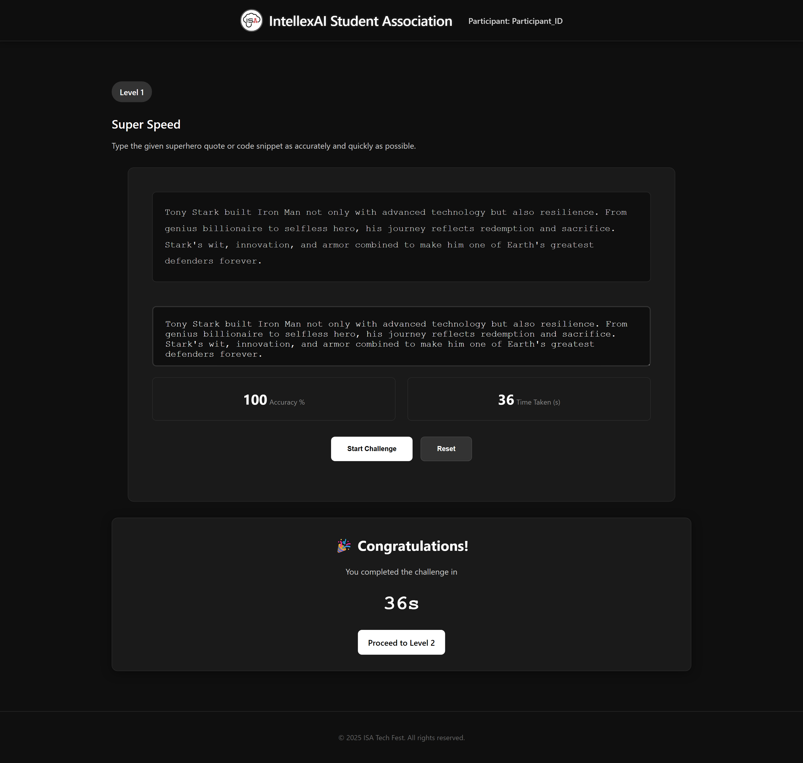

# ISA Tech Fest - Superhero Gauntlet

A multi-level coding competition platform developed for the IntellexAI Student Association (ISA) Tech Fest. Test your programming skills through three challenging levels inspired by superhero themes.

## 🚀 Features

- **Three Progressive Levels**: Each level increases in difficulty and tests different programming skills
- **Superhero Theme**: Engaging superhero-inspired UI and content
- **Real-time Performance Tracking**: Track accuracy, speed, and completion time
- **Responsive Design**: Works seamlessly across desktop and mobile devices
- **Dark Theme**: Modern dark UI with glassmorphism effects

---

## 🎮 Competition Levels

### Level 1: Super Speed (Speed Typing Challenge)

**Challenge**: Type superhero quotes and code snippets as accurately and quickly as possible

- **Time Limit**: No fixed limit (performance tracked)
- **Skills Tested**: Typing speed, accuracy, focus
- **Theme**: Spider-Man inspired
- **Completion Criteria**: 100% accuracy required to proceed

### Level 2: Code Scramble

**Challenge**: Rearrange scrambled code lines into the correct order

- **Skills Tested**: Code comprehension, logical thinking, programming knowledge
- **Interaction**: Use ↑ and ↓ buttons to reorder code lines
- **Completion**: Must arrange code in correct sequence to advance

### Level 3: Brainpower Showdown (Predict the Output)

**Challenge**: Predict the exact console output of given code snippets

- **Skills Tested**: Code execution tracing, logical reasoning, programming fundamentals
- **Format**: Input your predicted output and submit
- **Difficulty**: Requires deep understanding of code execution

---

## 🛠️ Technology Stack

- **Frontend**: HTML5, CSS3, JavaScript (Vanilla)
- **Styling**: Custom CSS with modern design principles
- **Storage**: SessionStorage for participant data
- **Architecture**: Multi-page application with shared JavaScript modules

## 🎯 How to Play

1. **Registration**: Enter your Participant ID on the homepage
2. **Level 1**: Complete the speed typing challenge with high accuracy
3. **Level 2**: Rearrange code lines in the correct order
4. **Level 3**: Predict the exact output of the given code snippet
5. **Completion**: Finish all levels to complete the gauntlet

## 🎨 Design Features

- **Superhero Theme**: Each level features different superhero backgrounds
- **Dark Mode**: Consistent dark theme throughout the application
- **Glassmorphism**: Modern glass-like UI elements with backdrop blur
- **Responsive Layout**: Adapts to different screen sizes
- **Smooth Animations**: CSS transitions and hover effects
- **Typography**: Clean, readable fonts with proper hierarchy

## 🏆 Scoring System

- **Level 1**: Based on typing speed (WPM) and accuracy percentage
- **Level 2**: Time taken to correctly arrange the code
- **Level 3**: Speed of correct output prediction
- **Overall**: Cumulative performance across all levels

## 🎉 Acknowledgments

- Superhero themes inspired by Marvel and DC universes
- Modern web design principles and best practices
- Community feedback and testing support

---
